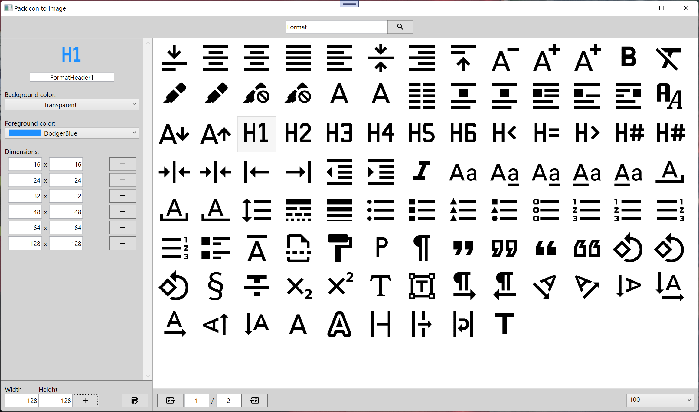
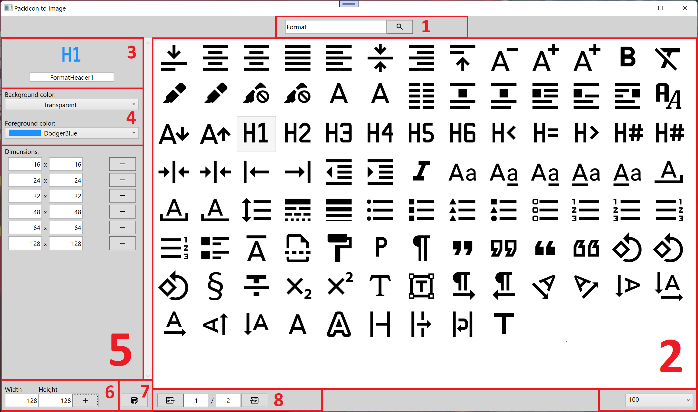

# chkam05.PackIconToImage
MaterialDesignInXamlToolkit PackIcon to image exporter.  

Application for exporting MaterialDesignInXamlToolkit PackIcons created as a path to image files in diffrent sizes.  

  

## Description

  

1. Search - allows to search PackIcon by its name. 
2. View - list of all or found PackIcons that can be selected for export (only one at the time). 
3. Informations - selected PackIcon with its name. 
4. Appearance - allows to set PackIcon color and background color of the exported image. 
5. List of selected dimensions for images that will be created, that can be removed or changed. 
6. Place for adding new image dimensions. 
7. Export button. 
8. Pages control and on the right side amount of PackIcons per page. 

# Related repositories 

materialdesigninxaml (PackIconKind): https://github.com/MaterialDesignInXAML/MaterialDesignInXamlToolkit  
